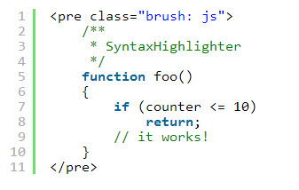

SyntaxHighlighter 的用法（译）
========================

下载
----
在 [官方下载页面](http://alexgorbatchev.com/SyntaxHighlighter/download/) ，点击 [Click here to download](http://alexgorbatchev.com/SyntaxHighlighter/download/download.php?sh_current) 下载。

- - - - - - - - - -

如何使用？
----------

翻译自 [官网原文](http://alexgorbatchev.com/SyntaxHighlighter/manual/installation.html)  

###基本步骤
要在你的页面上应用 `SyntaxHighlighter` ，你需要这样做：

1. 在你的页面上加载基本文件： `shCore.js` 和 `shCore.css`
2. 添加你想要的“笔刷”（例如，用 `shBrushJScript.js` 渲染 `JavaScript` ，查看 [可用的“笔刷”](http://alexgorbatchev.com/SyntaxHighlighter/manual/brushes/) 列表）
3. 引用 `shCore.css` 和 `shThemeDefault.css` 样式表
4. 使用 `<pre />` 或 `` ，即使是在 CDATA 代码块中的，大部分浏览器也会提前关闭 `<script type="syntaxhighlighter">` 标签。

**2.1版新特性** `SyntaxHighlighter` 会寻找带有特殊 `格式化class` 属性的 `<script type="syntaxhighlighter" />` 。该属性的格式化规则等同 `CSS` 的 `style` 行内式规则。唯一需要的参数是 `brush` （详见 [配置](http://alexgorbatchev.com/SyntaxHighlighter/manual/configuration/) ），且参数值只能设置为 [这些笔刷别名](http://alexgorbatchev.com/SyntaxHighlighter/manual/brushes/) 其中之一。

这里举个栗子（ **请注意 需要 CDATA 标签** ）：  
  
将被渲染为：  
  